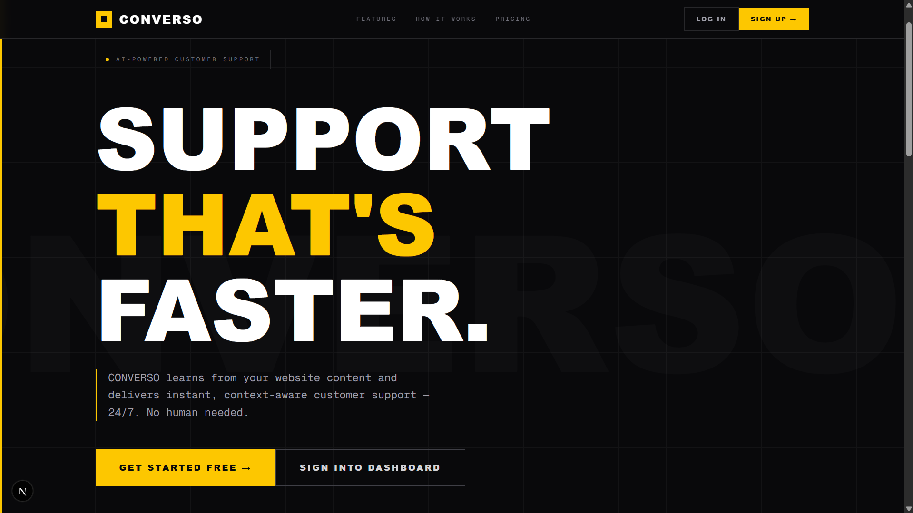

<h1 align="left">
  
  Converso — AI Powered Customer Support Platform
</h1>

> Build, train, and deploy AI powered customer support agents in minutes.

Converso is a **full-stack, multi-tenant AI customer support platform** that enables businesses to create intelligent, context-aware chatbots trained on their website content.

It uses **Retrieval Augmented Generation (RAG)**, vector embeddings, and LLMs (e.g., Gemini) to deliver accurate, real-time responses — securely and at scale.

---


## → Platform Preview

#### 01 — Landing Page  


---

#### 02 — Bot Training Interface


---

#### 03 — Public API Key Generation


---

#### 04 — Embedded Website Chat Widget


---

#### 05 — Account Creation Dashboard


---

# — Project Overview

Converso enables businesses to:

* Crawl and learn from website content
* Generate vector embeddings
* Use semantic search for relevant context
* Generate AI-powered responses
* Embed chat widgets with a secure public API key
* Manage tenants through a modern dashboard

It is built with **enterprise-grade security**, **multi-tenant architecture**, and scalable backend infrastructure.

---

# — Key Features

✔ Multi-tenant architecture (tenant-isolated data)
✔ JWT Authentication & Role-Based Access Control
✔ Website Content Crawling & Embeddings
✔ Retrieval-Augmented Generation (RAG)
✔ Gemini / LLM Integration
✔ Embeddable Chat Widget
✔ Frontend Admin Dashboard
✔ Dockerized Deployment

---

# — Architecture Overview

```
User Website
     │
     ▼
Chat Widget (widget.js)
     │
     ▼
Public Widget API (/api/widget/chat)
     │
     ▼
Chat Engine (RAG + LLM)
     │
     ▼
Vector Search (Embeddings)
     │
     ▼
Tenant-Isolated Database
```

---

# — Project Structure

```
CONVERSO-AI-customer-support-platform/
├── backend/                        # Spring Boot backend
│   ├── config/                     # Security, Mongo, AI configs
│   ├── security/                   # JWT & filters
│   ├── auth/                       # Signup / Login APIs
│   ├── tenant/                     # Multi-tenant services
│   ├── user/                       # User management
│   ├── ingestion/                  # Website crawler
│   ├── embeddings/                 # Vector embeddings & search
│   ├── chat/                       # Chat engine logic
│   ├── ai/                         # AI integration (Gemini)
│   ├── widget/                     # Public widget API
│   └── common/                     # Shared utilities
│
├── frontend/                       # React / Next.js dashboard
├── widget/                         # Embeddable widget scripts
├── docker-compose.yml
├── Dockerfile
├── pom.xml
└── README.md
```

---

# — Security Model

* JWT Authentication
* Role-Based Access Control (RBAC)
* Tenant isolation using `tenantId`
* Scoped public API keys (safe to expose)
* Secret key never exposed to frontend
* Token expiration & validation
* Input validation & exception handling

---

# — How It Works

### Step 01 — Train Your Bot  

* Provide your website URL
* Converso crawls all pages
* Content is chunked & embedded

### Step 02 — Generate Public API Key 

* Tenant-scoped public key
* Safe for frontend usage

### Step 03 — Embed the Chat Widget

Add this before `</body>`:

```html
<script>
  window.CONVERSO_WIDGET_CONFIG = {
    apiKey: "pk_live_XXXXXXXX",
    apiBaseUrl: "https://api.converso.ai",
    position: "bottom-right",
    theme: "light"
  };
</script>
<script src="https://cdn.converso.ai/widget.js" async></script>
```

### Step 04 — AI Chat Flow

```json
POST /api/widget/chat

{
  "apiKey": "pk_live_xyz",
  "conversationId": "uuid",
  "message": "Hello"
}
```

Response:

```json
{
  "response": "Hi! How can I help you today?"
}
```

---

# — Tech Stack

| Layer      | Technologies Used                       |
| ---------- | --------------------------------------- |
| Backend    | Spring Boot, Spring Security, Spring AI |
| Database   | MongoDB / MongoDB Atlas                 |
| AI Engine  | Gemini (LLM + Embeddings)               |
| Frontend   | Next.js, React                          |
| Deployment | Docker, Docker Compose                  |
| Widget     | Vanilla JS                              |

---

# — Getting Started

## Prerequisites

* Java 21+
* Docker & Docker Compose
* MongoDB Atlas (or local MongoDB)
* Node.js (for frontend)

---

## Backend Setup

```bash
git clone https://github.com/<your-username>/CONVERSO-AI-customer-support-platform.git
cd CONVERSO-AI-customer-support-platform
cp .env.example .env
docker compose up --build
```

Backend runs at:

```
http://localhost:8080
```

---

## Frontend Setup

```bash
cd frontend
npm install
npm run dev
```

---

# — Multi-Tenant Design

Each tenant has:

* Unique `tenantId`
* Public API key
* Isolated chat history
* Isolated embeddings
* Isolated configuration

---

# — Future Enhancements

* Admin analytics dashboard
* Conversation insights
* Custom prompt builder
* Fine-tuned AI models
* SaaS billing integration
* Rate limiting per tenant

---

# — Contributing

Pull requests are welcome.

1. Fork the repo
2. Create a new branch
3. Commit changes
4. Submit a PR

---
